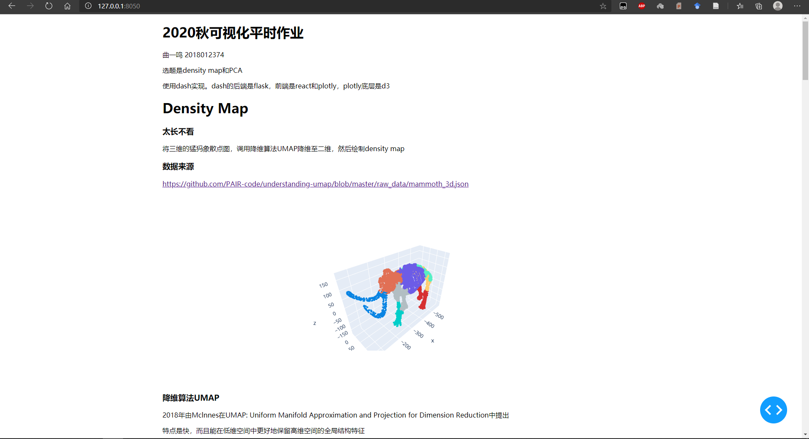

## 2020秋可视化平时作业

曲一鸣 2018012374 生81 quym@foxmail.com

选题为density map和PCA，两个作业放在同一个app里

基于dash/plotly实现

## 使用方法

适用于：Posix/bash

在当前文件夹中运行

```
python3 -m venv yourvenv
source yourvenv/bin/activate
pip install -r requirements.txt
python3 main.py
```

在浏览器打开http://127.0.0.1:8050

## 截图


